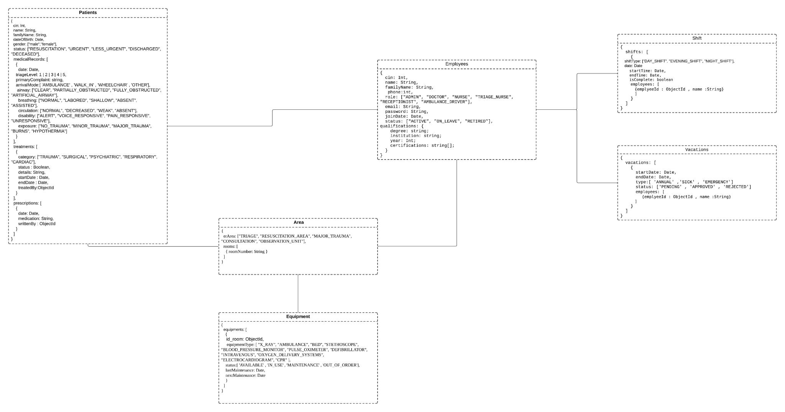

<h1 align="center">🚑 RescueOn - Intelligent Emergency </h1>

<p align="center">
  <em><em>
  RescueOn is an intelligent emergency coordination web app for medical teams, developed as part of the coursework at Esprit School of Engineering. Features real-time triage tracking and decision support tools.
</em>
 .</em>
</p>

## 📚 Table of Contents

- [✨ Features](#-features)
- [🛠 Tech Stack](#-tech-stack)
- [🗂 Data Model](#-data-model)
- [📦 Prerequisites](#-prerequisites)
- [🚀 Getting Started](#-getting-started)

---

## ✨ Features

- 🏥 Real-time resource and patient management
- 👩‍⚕️ Employees management
- 🧠 Smart triage decision support

---

## 🛠 Tech Stack

<p align="center">
  
  
  
  
</p>

---

## 🗂 Data Model

> The data model below illustrates how different entities are structured and related in RescueOn.

<p align="center">
  
</p>

---

## 📦 Prerequisites

Before running the project, ensure you have the following installed:

- [Git](https://git-scm.com/)
- [Node.js v16+](https://nodejs.org/)
- [React 18](https://reactjs.org/)
- [Python 3.10+](https://www.python.org/)

---

## 🚀 Getting Started

Follow these steps to set up and run the project locally:

```bash
# 1. Clone the repository
git clone https://github.com/MedEzzedineBenZbiba/PI_JS.git
```

```bash
# 2.Installing dependencies
npm install
```

### 🔁 Running the application

```bash
# 1. 🔧 Backend (Node.js)
cd nodeJS
npm start
```

```bash
# 2. 💻 Frontend (React)
cd react
npm run dev
```

```bash
# 3. 🧠 AI Service (Python)
python app.py 
```
